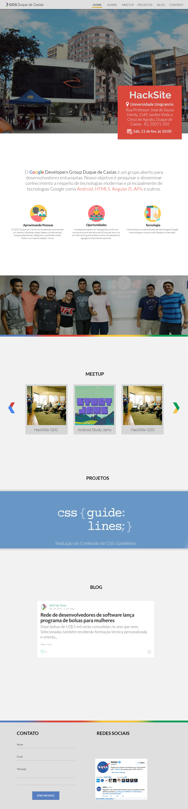

# Novo site do GDG Duque de Caxias

Pessoal, decidimos reformular site do GDG Duque de Caxias e torna-lo mais ativo,
fazendo com que o pessoal que participa dos encontros tenha nosso site como um
portal para buscar artigos, ver os próximos meetups e além disso ver os projetos
open-source que a comunidade ajuda a manter.

Nossa ideia é ter o site como uma Progressive Web App pois assim podemos informar
mais facilmente por meio de push notification os meetups que vão rolar e todos os
outros acontecimentos relacionados a nossa comunidade.

